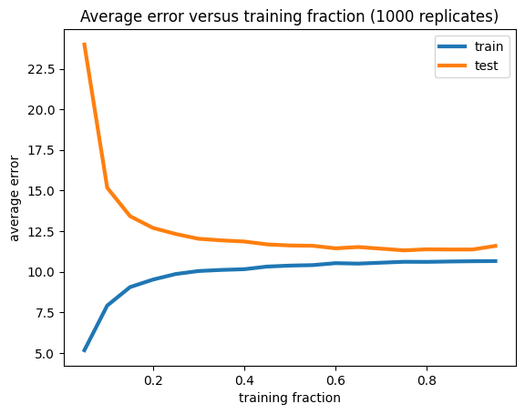
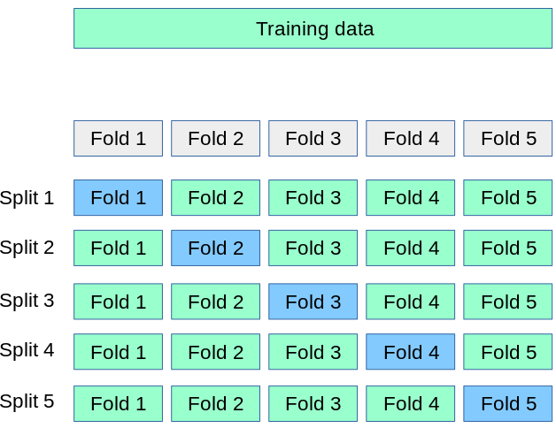
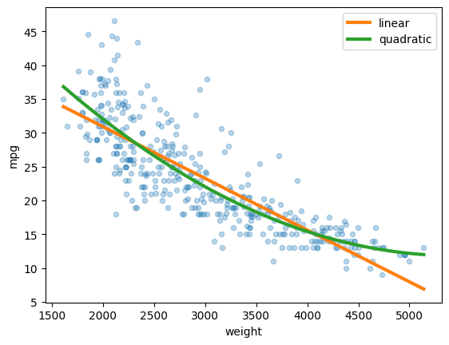
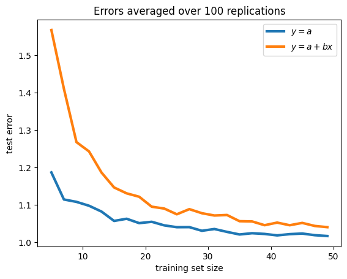

## Data splitting

- Split data into a **training set** and a **testing set**, setting aside the latter for estimation of predictive error.

- *Once you make a modeling decision based on your testing set, it's not a testing set anymore!* This is called **data leakage**.

---

### How should you split?

- More training data is better!

---

### **Leave-One-Out Cross Validation (LOOCV)**

- Training set of size $n-1$, test set of size $1$.

- Need to fit $n$ models. Could be prohibitive for large datasets or complex models.

- The LOOCV estimate of the predictive error for a linear model fit to the `auto` dataset is 11.29.

---

### **$k$-fold Cross Validation (CV)**

(Figure cropped from [the scikit-learn cross-validation docs](https://scikit-learn.org/stable/modules/cross_validation.html).)

---

### **$k$-fold Cross Validation (CV)**

- $k$ train/test splits; training sets of size
$\frac{(k-1)n}{k}$, test sets of size $\frac nk$.

- Use $k=5$ (default in `scikit-learn`) unless you have a reason not to.

- Repeat a few times, computational budget permitting.

- The average, over 1000 train/test splits, of 5-fold CV estimate of the predictive error for a linear model fit to the `auto` dataset is 11.36.

---

## Model Selection

- If you care primarily about predictive performance, use it as a metric for model selection.

### Example: `auto` dataset

- **Model $M_1$**: linear regression of `mpg` on `weight`

- **Model $M_2$**: linear regression of `mpg` on `weight` and `weight**2`

- predictive error, estimated with 5-fold CV, 100 times:
$$
\operatorname{MSE}(M_1)\approx 18.9,\qquad
\operatorname{MSE}(M_2)\approx 17.5
$$

---

---

### Overfitting

- A complex model can yield worse predictive performance than a simple one.

- Red flag: Low training error, high testing error

- **Example:** If $x_i$ and $y_i$ are independent with 
  $$
  y_i \sim N(\alpha, 1),
  $$
  then the predictive error of the full linear model $y=a + bx$ exceeds that of the intercept-only linear model $y=a$. (What would an *F*-test say in this situation?)

---

